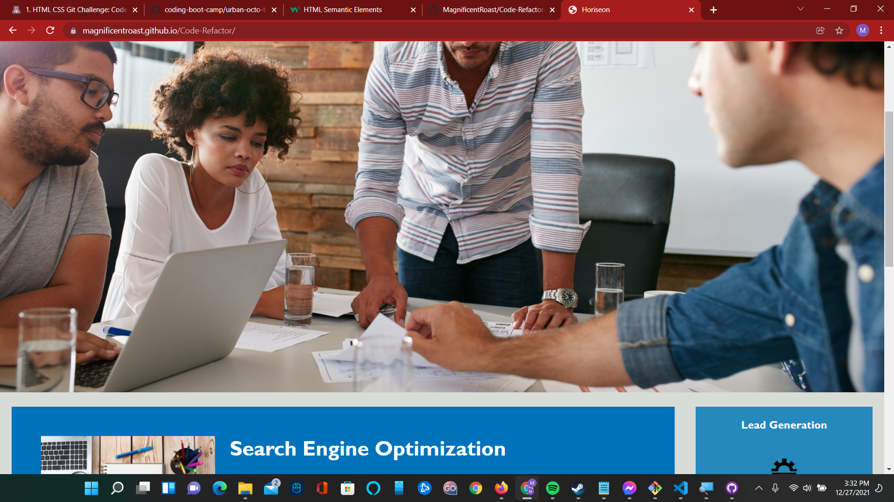

CODE REFACTORING CHALLENGE

Goal: Refactor the code to make it adhere to accessibility standards, and increase Search Engine Optimization.

While the code was functional, there are a lot of div tags present, the goal is to change things so everything is functional and easy to read, while meeting accessibility standards.

The "search engine optimization" navigation link was broken when the code was received, that was fixed.

I have replaced all of the "div" tags that I could to semantic HTML, and changed the stylesheet to pick up on the new elements, allowing for easier to read code.

In style.css, you will see comments that will show you where in the HTML document this style applies to.

There was an issue with "Search engine optimization" in the navigation section, that has been fixed, I have also enabled clicking on the Horiseon logo at the top of the page so, in the event that you would like to add additional pages to this web page, you will be able to return to this landing page if you need to.

The link to the deployed application is https://MagnificentRoast.github.io/Code-Refactor.

